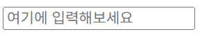

# JSTEST 프로젝트

- index.html: 홈 화면
- test1.html ~ test5.html: 실습 테스트 페이지

- 개념 정리
1. <input type="" id = "" placeholder="여기에 입력해보세요">
    <input>태그의 placeholder속성 : 입력 요소에 아무 값도 입력되지 않았을 때 표시되는 '안내문'
    

2. textContent :  HTML 요소의 텍스트(문자) 내용을 가져오거나 설정할 수 있는 JS 속성
    ex) document.getElementById("displayText").textContent=this.value;  

